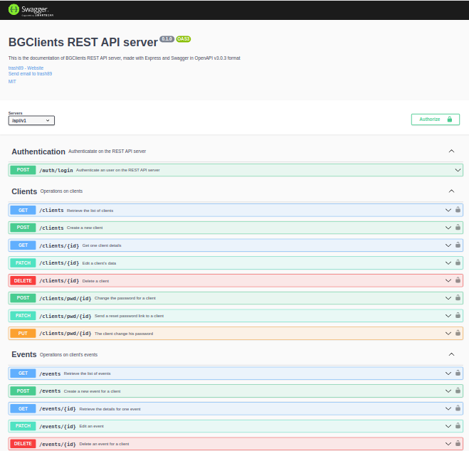

# REST API server for BG Clients Application

The BG Clients Application is allowing to keep track of the clients for a lawyer office.\

It allows the creation of a private secured area for clients in order to communicate them useful informations like events and PDF files they can consult and download.\

Once the application administrator creates a client, an user is created on Supabase with his email and a default password.\

The administrator can enter events and files for clients.\

When a client connects, he can view his informations on his secured area and download his files. He can also change his own password and the administrator can also reset his password to the default one.

The Frontend is live on Vercel platform : https://bgclients.vercel.app

This repository contains the REST API server, with routes documented with Swagger and OpenAPI standard, with API routes tested with Cypress E2E.

Live at https://bgclientsserver.vercel.app

### `Enjoy! :)`
